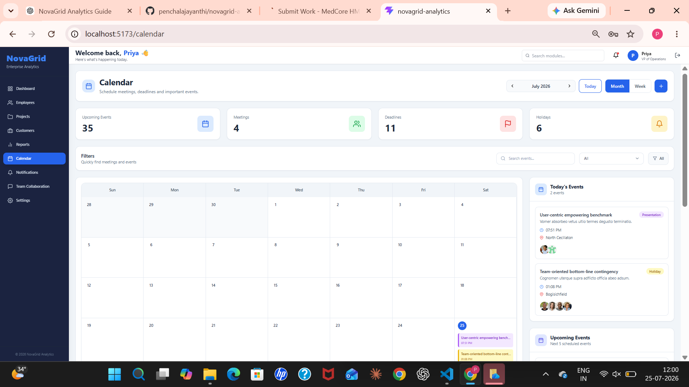
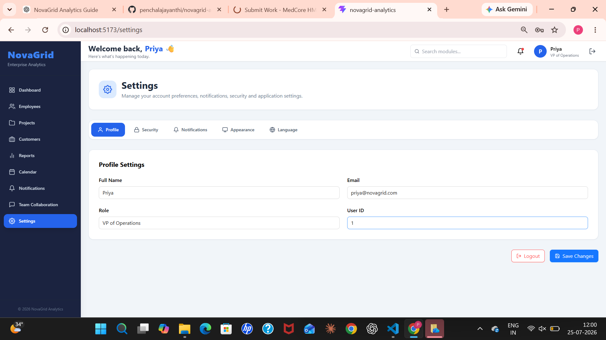

# 🚀 NovaGrid Analytics

A modern **Enterprise Analytics Dashboard** built with **React, TypeScript, Vite, Tailwind CSS, Zustand, Ant Design, Material UI, and Recharts**.

NovaGrid Analytics helps organizations manage employees, projects, customers, reports, collaboration, notifications, and business insights through an intuitive and responsive dashboard.

---

# 📸 Project Preview

> Replace these images with screenshots from your project.

## Dashboard


---

## Employee Management


---

## Projects


---

## Reports


---

## Team Collaboration


---

## Calendar



---

## Settings



---

# ✨ Features

## 🔐 Authentication

- Login
- Register
- Forgot Password
- OTP Verification
- Reset Password
- Protected Routes

---

## 📊 Dashboard

- KPI Cards
- Revenue Analytics
- Project Status
- Quick Actions
- Recent Activities
- Business Charts

---

## 👨‍💼 Employee Management

- Employee Directory
- Employee Profile
- Attendance
- Leave Management
- Salary Information
- Performance Tracking

---

## 📁 Project Management

- Kanban Board
- Project Timeline
- Team Members
- Tasks
- Milestones

---

## 👥 Customer Management

- Customer Profiles
- Purchase History
- Customer Notes
- Support Details
- Tags

---

## 📈 Reports

- Revenue Reports
- Sales Reports
- Marketing Reports
- Employee Performance
- Export Reports

---

## 📅 Calendar

- Month View
- Week View
- Event Management
- Upcoming Events
- Today's Schedule

---

## 💬 Team Collaboration

- Chat System
- Multiple Conversations
- New Chat
- Auto Replies
- Shared Files
- Online Members
- Team Statistics

---

## 🔔 Notifications

- Notification Center
- Notification Filters
- Real-time Updates

---

## ⚙️ Settings

- Profile
- Security
- Notifications
- Appearance
- Language

---

## 🌙 Themes

- Light Theme
- Dark Theme

---

# 🛠️ Tech Stack

| Technology | Usage |
|------------|-------|
| React | Frontend |
| TypeScript | Type Safety |
| Vite | Build Tool |
| Tailwind CSS | Styling |
| Zustand | State Management |
| React Router | Routing |
| Ant Design | UI Components |
| Material UI | Tooltips & UI |
| Recharts | Charts |
| React Icons | Icons |

---

# 📁 Project Structure

```text
src
├── app
├── assets
├── components
│   ├── common
│   ├── layout
│   ├── tables
│   └── ui
│
├── constants
├── contexts
├── data
│
├── features
│   ├── auth
│   ├── dashboard
│   ├── employees
│   ├── customers
│   ├── projects
│   ├── reports
│   ├── calendar
│   ├── notifications
│   ├── collaboration
│   └── settings
│
├── hooks
├── layouts
├── routes
├── store
└── styles
```

---

# 🚀 Getting Started

## Clone Repository

```bash
git clone https://github.com/penchalajayanthi/novagrid-analytics.git
```

## Navigate into Project

```bash
cd novagrid-analytics
```

## Install Dependencies

```bash
npm install
```

## Run Development Server

```bash
npm run dev
```

---

# 📦 Build

```bash
npm run build
```

---

# 👀 Preview Production Build

```bash
npm run preview
```

---

# 📌 Modules

✅ Authentication

✅ Dashboard

✅ Employees

✅ Customers

✅ Projects

✅ Reports

✅ Calendar

✅ Team Collaboration

✅ Notifications

✅ Settings

---

# 📊 Highlights

- Responsive Design
- Feature-based Architecture
- Reusable Components
- State Management using Zustand
- Charts & Analytics
- Team Collaboration Module
- Protected Authentication
- Modern UI Design
- TypeScript Support

---

# 📚 Folder Architecture

- Feature-based architecture
- Reusable UI Components
- Shared Hooks
- Services Layer
- Type Definitions
- Mock Data Layer
- State Management
- Route Guards

---

# 📱 Responsive Design

The application is optimized for:

- 💻 Desktop
- 💼 Laptop
- 📱 Tablet

---

# 👨‍💻 Developed By

**Jayanthi**

GitHub:
https://github.com/penchalajayanthi

LinkedIn:
(https://www.linkedin.com/in/jayanthi-51739b3b7/)

---

# ⭐ Repository

If you found this project useful, consider giving it a ⭐ on GitHub.

---

# 📄 License

This project was developed for learning and internship purposes.